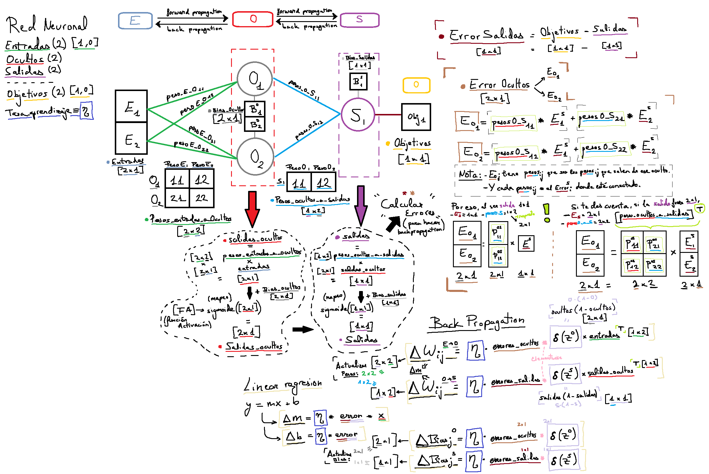

# 🧠 Red Neuronal en Java

Este repositorio contiene una implementación desde cero de una red neuronal en Java. Comienza con perceptrones simples y evoluciona hacia redes multicapa, con el objetivo de experimentar con funciones de activación, entrenamiento, y más adelante, construir un entorno donde mini entidades aprendan a través de estas redes.

---

## 🚀 Objetivos del proyecto

- Implementar perceptrones simples.
- Probar distintas funciones de activación (ReLU, Sigmoid, Tanh, etc.).
- Construir arquitecturas más complejas (redes multicapa, feedforward...).
- Entrenamiento con y sin retropropagación.
- Resolver tareas simples (XOR, clasificación binaria...).
- En etapas futuras: crear un entorno de mini agentes que aprendan.

---

## 🛠️ Tecnologías utilizadas

- **Lenguaje:** Java
- **IDE:** IntelliJ IDEA
- **Dependencias:** Ninguna (implementación 100% desde cero)

---

## 📁 Estructura del repositorio

```
/src
├── java
│   ├── Main.java
│   ├── Perceptron.java
│   └── Punto.java
├── javascript
│   ├── index.html
│   ├── matrix.js
│   ├── RedNeuronal.js
│   └── sketch.js
/rec
└── esquema_red_neuronal.png
```

---

## ✅ Estado actual

- [x] Perceptrón simple funcionando
- [x] Funciones de activación personalizables
- [x] Red neuronal multicapa
- [x] Algoritmo de retropropagación
- [x] Simulación de agentes que aprenden

---

## 🧪 Funcionamiento y fórmulas




## 💡 Ideas futuras

- Visualización del aprendizaje (gráficas, evolución del error...)

- Interfaz gráfica (JavaFX)

- Integración con entornos simulados

- Aprendizaje por refuerzo básico

- Algoritmos evolutivos

